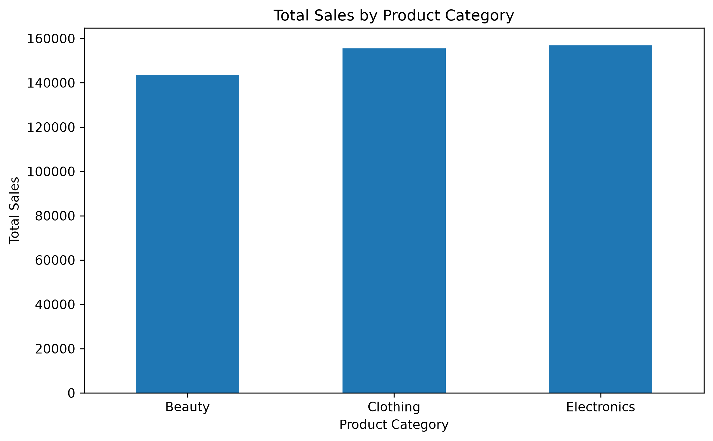
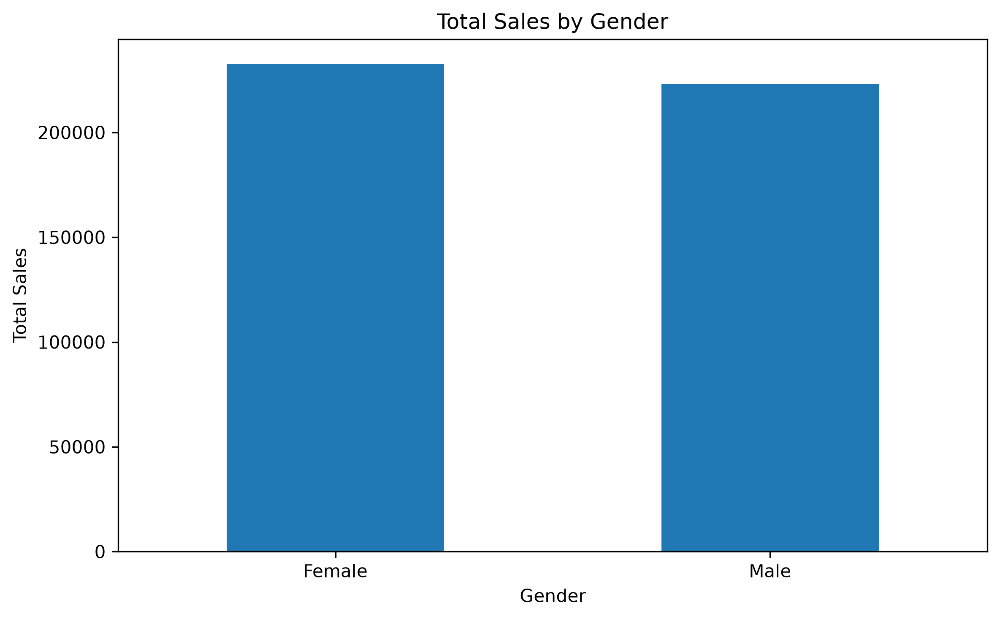
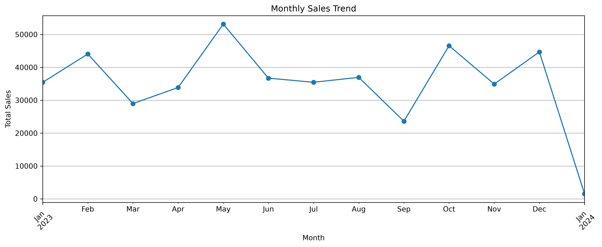
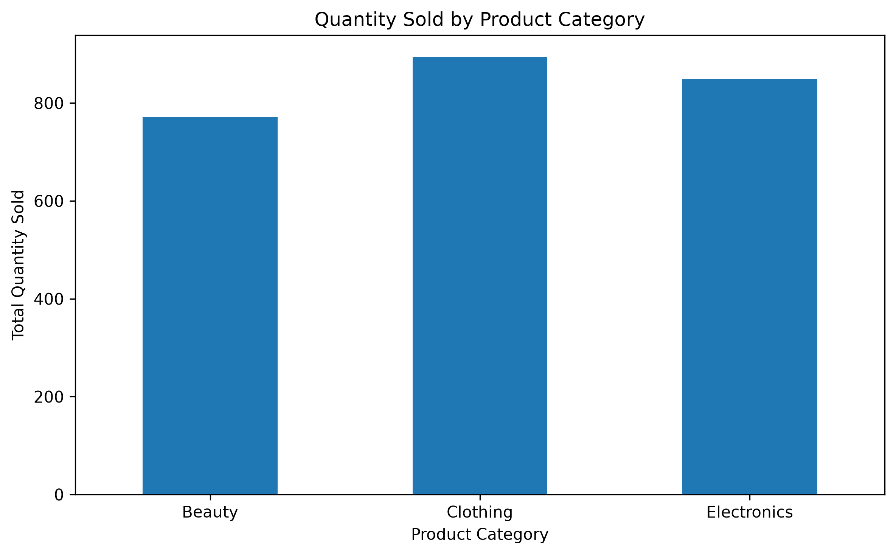
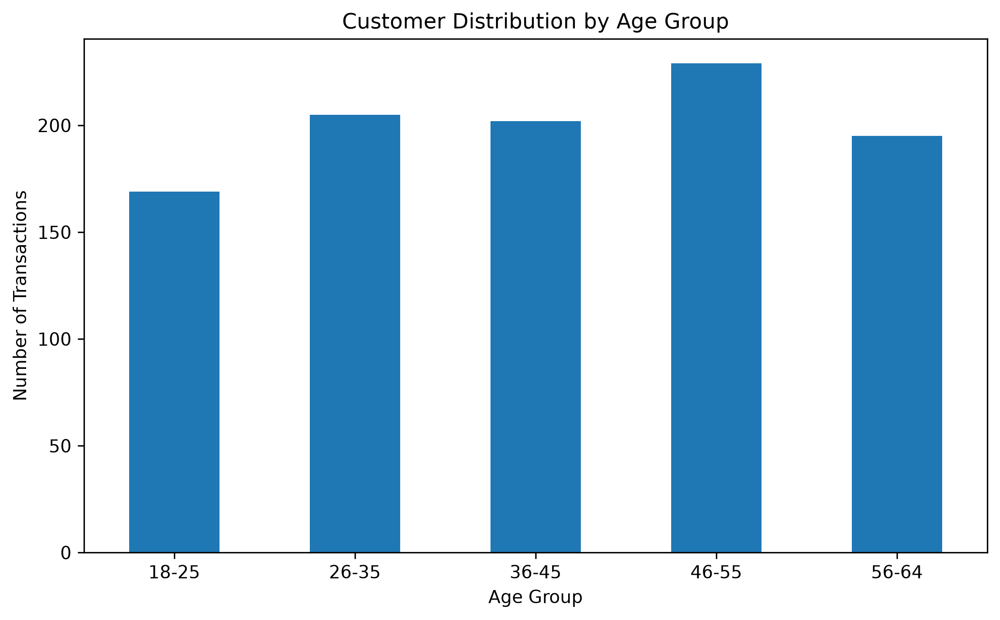

# 📊 Retail Sales Data Analysis — OIBSIP Task 1

## 📌 Project Overview

This project performs **Exploratory Data Analysis (EDA)** on a retail sales dataset to identify sales patterns, customer behavior, product performance, and monthly sales trends.

The project was completed as part of the **Oasis Infobyte Internship Program (OIBSIP) — Data Analytics Level 1, Task 1**.

---

## 🎯 Objectives

* Analyze retail sales transaction data
* Clean and preprocess the dataset
* Explore customer demographics
* Analyze sales by product category
* Compare sales by gender
* Analyze monthly sales trends
* Study customer age-group distribution
* Visualize important business insights

---

## 📂 Project Structure

```text
DataAnalytics-L1-Task1-EDARetailSales/
│
├── data/
│   ├── raw/
│   │   └── retail_sales_dataset.csv
│   │
│   └── processed/
│       └── retail_sales_cleaned.csv
│
├── notebooks/
│   ├── Retail_Sales_EDA.ipynb
│   └── README.md
│
├── outputs/
│   ├── age_group_distribution.png
│   ├── monthly_sales_trend.png
│   ├── quantity_by_category.png
│   ├── sales_by_category.png
│   └── sales_by_gender.png
│
├── .gitignore
└── README.md
```

---

## 📊 Dataset

The dataset contains **1,000 retail transactions**.

### Columns

| Column           | Description                      |
| ---------------- | -------------------------------- |
| Transaction ID   | Unique transaction identifier    |
| Date             | Transaction date                 |
| Customer ID      | Unique customer identifier       |
| Gender           | Customer gender                  |
| Age              | Customer age                     |
| Product Category | Beauty, Clothing, or Electronics |
| Quantity         | Number of products purchased     |
| Price per Unit   | Price of one product             |
| Total Amount     | Total transaction value          |

---

## 🛠️ Technologies Used

* Python
* Pandas
* NumPy
* Matplotlib
* Seaborn
* Jupyter Notebook
* Git
* GitHub

---

## 🔍 Data Analysis Performed

### 1. Data Inspection

The dataset was inspected using:

* `head()`
* `info()`
* `describe()`
* `dtypes`
* Missing-value analysis

### 2. Data Cleaning

The dataset was checked for:

* Missing values
* Incorrect data types
* Duplicate records
* Invalid values

No missing values were found in the analyzed columns.

### 3. Product Category Analysis

The dataset contains three product categories:

* Clothing
* Electronics
* Beauty

Sales revenue was compared across these categories.

### 4. Gender Analysis

Total sales were analyzed by gender.

The analysis showed that female customers generated slightly higher total sales than male customers.

### 5. Monthly Sales Analysis

Monthly sales were calculated to identify changes in sales performance throughout the year.

### 6. Age Group Analysis

Customers were grouped into:

* 18–25
* 26–35
* 36–45
* 46–55
* 56–64

The **46–55 age group** had the highest number of transactions in the dataset.

---

## 📈 Visualizations

The project includes the following visualizations:

### Sales by Category



### Sales by Gender



### Monthly Sales Trend



### Quantity by Category



### Age Group Distribution



---

## 💡 Key Insights

* The dataset contains **1,000 transactions**.
* Clothing has **351 transactions**, followed by Electronics with **342** and Beauty with **307**.
* Total sales were highest for **Electronics**, followed closely by Clothing.
* Female customers generated higher total sales than male customers.
* The **46–55 age group** had the highest transaction count.
* Monthly sales varied considerably throughout the analyzed period.
* May recorded one of the strongest monthly sales performances.

---

## 🚀 How to Run the Project

### 1. Clone the repository

```bash
git clone https://github.com/SanjaykumarBejjanki/DataAnalytics-L1-Task1-EDARetailSales.git
```

### 2. Navigate to the project

```bash
cd DataAnalytics-L1-Task1-EDARetailSales
```

### 3. Install required libraries

```bash
python -m pip install pandas numpy matplotlib seaborn jupyter
```

### 4. Start Jupyter Notebook

```bash
jupyter notebook
```

### 5. Open the notebook

Open:

```text
notebooks/Retail_Sales_EDA.ipynb
```

Run the cells from top to bottom.

---

## 📁 Output

The analysis produces cleaned data and visualization files that are stored inside the `data/processed/` and `outputs/` directories.

---

## 👨‍💻 Author

**Sanjay Kumar Bejjanki**

GitHub:
https://github.com/SanjaykumarBejjanki

---

## 📜 Internship

**Oasis Infobyte — OIBSIP**

**Track:** Data Analytics
**Level:** Level 1
**Task:** Task 1 — Exploratory Data Analysis on Retail Sales Data
